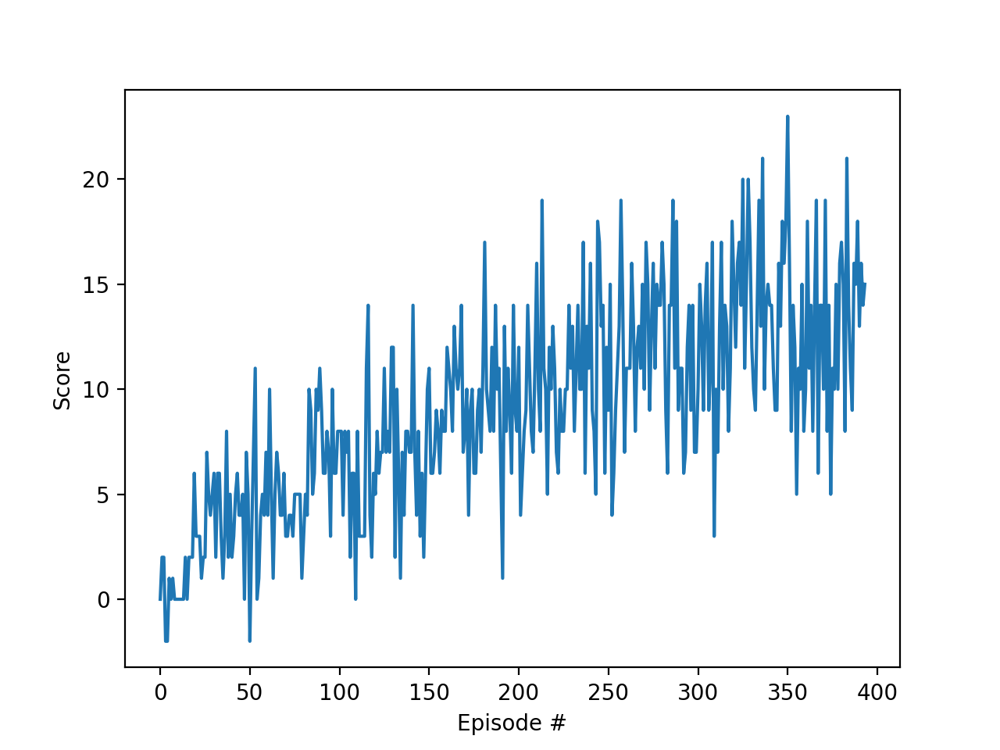

# Project report

## Learning algorithm
 - Deep Q-Learning algorithm was used with below hyper parameters. 
 - Hyper parameters
    - Replay buffer size = 1e5  
    - Minibatch size = 64    
    - Discount factor gamma = 0.99          
    - Soft update rate tau = 1e-3              
    - Learning rate = 5e-4           
    - Period of network update/learn (steps) = 4
  - Neural Network Model:
    - Linear: (state_size, 128) - ReLu
    - Linear: (128, 64) - ReLu
    - Linear: (64, action_size)

## Plot of rewards

## Ideas of future work

- Adjust hyperparameters for faster convergence
- Test to see if updating target network at fixed intervals instead of soft update improves convergence time
- Implement policy based methods to test for faster convergence
